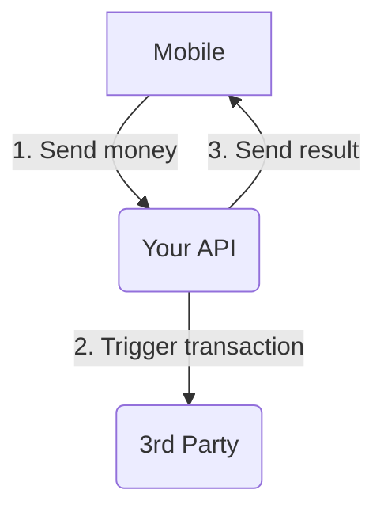

# How to start

## Start and manual test

`docker compose up`

You can `curl` directly to our API on port `3200` for instance :

```
curl -H 'Content-Type: application/json' -d '{"amount":24}' localhost:3200/transaction
```

To isolate a test case, you may pass a `workingConditions` object, like so :

```
curl -H 'Content-Type: application/json' -d '{"amount":22, "workingConditions": { "shouldTimeout": true, "shouldTimeoutAndWork": true, "shouldSendWebhook": false } }' localhost:3200/transaction
```

- `shouldTimeout` : if true, the third party will return a 504
- `shouldTimeoutAndWork` : if false and `shouldTimeout` true, the third party will drop the request
- `shouldSendWebhook` : if true, will trigger the webhook, only applicable if `shouldTimeout` is false

For more specs, please refer to `your_api/test/app.e2e-spec.ts`

Also you may consider reading developer's log in `your_api/README.md`.

## Automated test

You will need to have these containers started :

  - `db`
  - `thirdparty`
  - `redis`

You can start individual containers with `docker compose up db` for instance.

To run automated end to end tests : 

`cd your_api && npm run test:e2e`

## Flutter front

There's a flutter front that allows to see the websocket in action. You may start it with your favorite IDE or with `flutter run`. This should be Dockerized but alas no docker image with the right flutter version has been found in the public space.

# Djamo's take-home test for API Software Engineer candidates

The goal of this test is to be a _work sample_. Instead of asking you to solve a quizz, implement fizzbuzz or a binary tree search, we would like you to work on something similar to our work. A very common task at Djamo is to integrate with third parties, and while we try to keep our services highly available, fast and reliable, unfortunately we often face issues with our partners.

However, it is Djamo's mission to bring the best experience to our customers. That means it is our duty to handle cleanly all of these errors, so that from a user perspective it looks like everything went fine. This test will give you a glimpse of the issues we can face with 3rd parties.

## Context



You're tasked to developed an API. A mobile application will call your API, and in turn you'll have to call an external service. If the transfer worked, you'll have to notify the mobile application of the success, otherwise, of the failure.

### 3rd party's constraints

As mentionned before, our partners have a number issues, and this one has its share:

- it does not return immediatly if it worked, or not
- it takes a long time to answer (up to 10s)
- it is supposed to call you back through a webhook -- but sometimes it doesn't
- it has a status check API -- but they explicitely said they could block our services if we request it too often
- it will time out (HTTP 504) from time to time, but sometimes the request actually will go through after a longer time (up to 120s).

### Your constraints

Your API is consumed by a mobile application, and the experience needs to feel pleasant for the user. So you need to:

- return a response as fast as possible
- return the success / failure of the transaction as quickly as possible

Due to poor network connectivity, sometimes the mobile application will re-try to send the same request twice. You must detect it and only handle the request once.

## Structure

You can start the project easily by running `docker compose up -d --watch`. This will start a mock for the 3rd party service and for the client application. We encourage to take a look at the different READMEs to understand the global picture.

```
.
├── docker-compose.yml
├── README.md
├── client
│   └── README.md
├── thirdpartymock
│   └── README.md
└── your_api
    └── README.md
```

If you want to perform some tests after your compose is up, you can run the following cURL:

```
curl -H 'Content-Type: application/json' -X POST localhost:3100/transaction
```

This will ask the client application to trigger a transaction creation. Which in turn will call your API.
